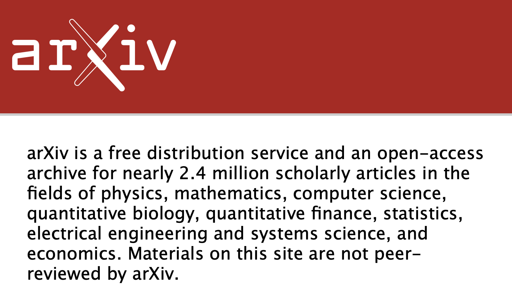

# erdos-arxiv

arXiv Chatbot
Erdos Deep Learning Boot Camp (June 7 - Aug 29 2024)

Team: Tantrik Mukerji, Ketan Sand, Xiaoyu Wang, Tajudeen Mamadou Yacoubou, Guoqing Zhang
Github: https://github.com/xywang2017/erdos-arxiv 
App: https://erdos-arxiv-chatbot.streamlit.app/ 
 

arXiv.org is the largest open database available containing nearly 2.4 million research papers. Current methods to search the ArXiv involve key-word matching which are considered out-dated by today's standards. A large language model (LLM) having access to such a dataset will make it unprecedented in generating updated, relevant, and, more importantly, precise information with citable sources. In such situations, RAG pipelines can be used to provide context, in simpler terms, RAG is a technique used to enhance the accuracy and reliability of generative AI models by using information from external sources. 

This is exactly what we have done in this project. We have refined the capabilities of Google’s Gemini 1.5 pro LLM by building a customized RAG pipeline that has access to the entire arXiv database. We then deployed the entire package into an app that mimics a chatbot to make the experience user-friendly.

**Stakeholders** - Academics, Universities, All companies R&D department ranging from Medicine to Computer Science and even economics.

