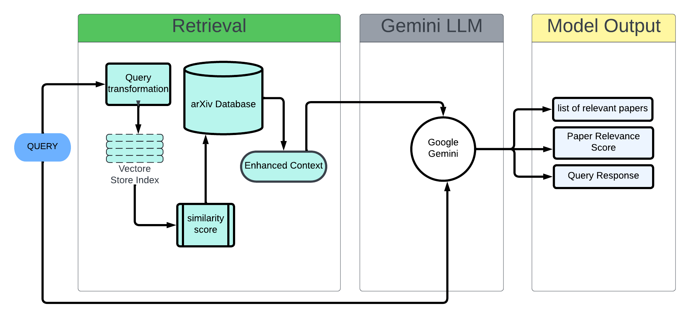

# erdos-arxiv

arXiv Chatbot
Erdos Deep Learning Boot Camp (June 7 - Aug 29 2024)

**Team:** Tantrik Mukerji, Ketan Sand, Xiaoyu Wang, Tajudeen Mamadou Yacoubou, Guoqing Zhang\
**Github:** https://github.com/xywang2017/erdos-arxiv \
**App:** https://erdos-arxiv-chatbot.streamlit.app/ 

arXiv.org is the largest open database available containing nearly 2.4 million research papers. Current methods to search the ArXiv involve key-word matching which are considered out-dated by today's standards. A large language model (LLM) having access to such a dataset will make it unprecedented in generating updated, relevant, and, more importantly, precise information with citable sources. In such situations, RAG pipelines can be used to provide context, in simpler terms, RAG is a technique used to enhance the accuracy and reliability of generative AI models by using information from external sources. 

This is exactly what we have done in this project. We have refined the capabilities of Google’s Gemini 1.5 pro LLM by building a customized RAG pipeline that has access to the entire arXiv database. We then deployed the entire package into an app that mimics a chatbot to make the experience user-friendly.

**Stakeholders** - Academics, Universities, All companies R&D department ranging from Medicine to Computer Science and even economics.

**Results** 

-  We stress tested our RAG+LLM pipeline on a broad spectrum of topics covered by arXiv.org, such as linguistics, condensed matter physics, astrophysics, and so on. We included a few demos in the examples/ folder. The results are generally satisfactory in the eyes of team members who are domain experts, and more quantitative metrics described as follows.
*  The Document Ranking stage of the pipeline generally retrieves relevant documents based on the user query, with relevance scores in the 0.5 to 0.8 range (with 1 being the highest and 0 the lowest). Higher scores are typically obtained if the user query contains keywords that are also in the document summaries.
+  The final generated response is contextualized with the retrieved documents, providing accurate answers while also citing relevant sources. A generic language model clearly would not have been able to achieve this, therefore demonstrating the success of our pipeline.
+  The pipeline is deployed as a web app at https://erdos-arxiv-chatbot.streamlit.app/, which has a clean user interface, and instructions on how to use it.  

